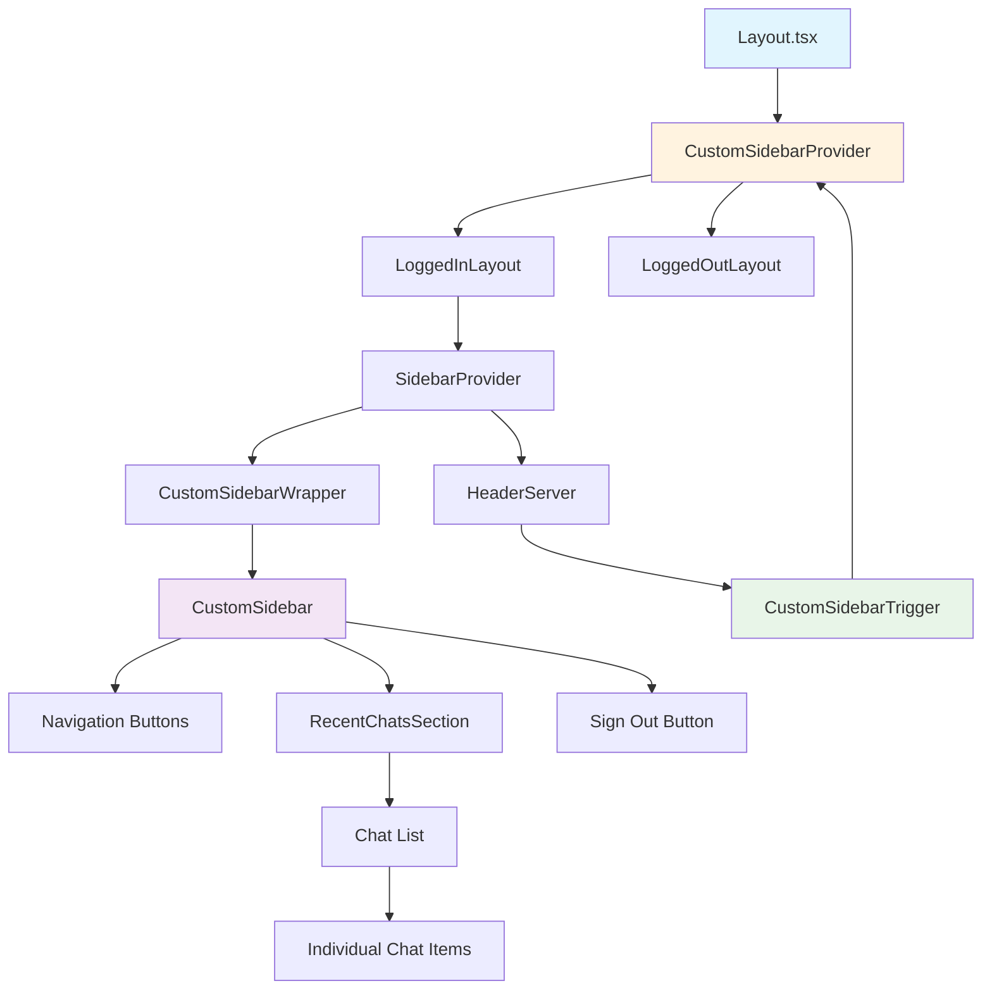

# State Report: Custom Sidebar Implementation

**Last Updated:** 2025-07-20

## 1. Overview

This document provides detailed implementation specifics for the custom sidebar component. For architectural overview and design system patterns, see the **[UI Architecture State Report](./ui-architecture-state-report.md)**.

The custom sidebar implementation replaces the existing shadcn sidebar with a custom component that matches the Figma design exactly. The sidebar features a cyan outline with transparent background, is positioned below the header with proper spacing, includes navigation buttons with icons, and has smooth slide-out animations. The implementation maintains all existing functionality while moving the logout button from the header to the sidebar footer and changing the text from "logout" to "sign out".

**Cross-Cutting Concerns**: The sidebar interacts with the header component for toggle functionality, uses the authentication system for session management, integrates with the chat system for recent chats display, and follows the established design system patterns.

## 2. Key Components & File Paths

- **`src/components/ui/custom-sidebar.tsx`** - Main sidebar component with fixed positioning and cyan outline styling
- **`src/components/ui/custom-sidebar-context.tsx`** - React context for sidebar open/close state management
- **`src/components/ui/custom-sidebar-trigger.tsx`** - Toggle button component connected to custom sidebar context
- **`src/app/_components/client/CustomSidebarWrapper.tsx`** - Client wrapper component for data fetching and session management
- **`src/app/_components/client/RecentChatsSection.tsx`** - Component for displaying recent chats with expandable functionality
- **`src/app/layout.tsx`** - App-level layout with CustomSidebarProvider integration

## 3. Implementation Details & Quirks

### Sidebar-Specific Complex Logic

**Dynamic Positioning System**: The sidebar uses `calc()` functions for positioning to account for the dynamic header height:
```tsx
style={{
  top: 'calc(123px + 32px)',
  height: 'calc(100vh - 123px - 64px)',
  transform: isOpen ? 'translateX(0)' : 'translateX(-100%)'
}}
```

**Context Provider Scope**: The CustomSidebarProvider must wrap the entire application at the layout level to ensure the context is available to all components, including the header toggle button. This prevents the "useCustomSidebar must be used within a CustomSidebarProvider" error.

### Sidebar-Specific Workarounds

**Server/Client Component Separation**: The original AppSidebar was a server component, but the custom implementation requires client-side features (session management, data fetching). The solution was to create a client wrapper component (`CustomSidebarWrapper`) that handles all client-side logic while maintaining the server component architecture.

**React Hooks Rules**: The initial implementation had conditional hook calls in `CustomSidebarWrapper`. The fix was to call hooks unconditionally and combine conditional checks:
```tsx
// Before (caused errors)
if (user) {
  const { data: chats } = useQuery(...)
}

// After (works correctly)
const { data: chats } = useQuery(['chats'], fetchChats, {
  enabled: !!user
})
```

### Sidebar-Specific Styling Hacks

**Fixed Positioning with Dynamic Height**: The sidebar uses fixed positioning with dynamic height calculations to prevent layout shifts and ensure proper positioning below the header without affecting the main content flow.

**CSS Transform Animations**: Uses `transform: translateX()` for slide animations instead of changing layout properties, ensuring smooth performance without layout recalculations.

**Cyan Outline Implementation**: The cyan outline is implemented using `border border-[rgba(0,229,255,0.99)]` with rounded corners to match the Figma design exactly.

### Sidebar-Specific "Gotchas"

**Context Provider Placement**: The CustomSidebarProvider must be at the app level in layout.tsx, not just wrapping the logged-in layout. This ensures the context is available for both logged-in and logged-out states.

**Button Spacing**: The navigation buttons require specific padding and margin values to match the Figma design. The spacing is critical for visual alignment with the recent chats list.

**Recent Chats Alignment**: The bullet points in the recent chats list must align with the navigation button icons. This requires careful padding adjustments to maintain visual consistency.

**Slide Animation Timing**: The slide animation uses `duration-300 ease-in-out` for smooth performance. Faster animations can feel jarring, while slower ones feel sluggish.

### Sidebar-Specific Type Safety & Middleware Patterns

**Session Type Safety**: The implementation uses proper TypeScript types for session management and ensures type safety across server/client boundaries.

**React Query Integration**: Uses React Query for data fetching with proper error handling and loading states.

### Sidebar-Specific Cross-System Integration

**Header Integration**: The sidebar toggle button in the header connects to the custom sidebar context, allowing seamless integration without modifying the header component itself.

**Authentication Integration**: The sidebar displays user-specific content (recent chats, sign out button) based on authentication state, integrating with the existing auth system.

**Navigation Integration**: All navigation links maintain their existing functionality while using the new custom styling.

## 4. Dependencies

### External Libraries
- **React Query** (TanStack Query) - For client-side data fetching and caching
- **Next.js Image** - For optimized image rendering of sidebar icons
- **Tailwind CSS** - For styling and responsive design
- **React Context API** - For sidebar state management

### Internal Dependencies
- **Authentication System** - For session management and user state
- **tRPC API** - For fetching recent chats data
- **Design System** - For colors, spacing, and typography tokens
- **Header Component** - For sidebar toggle functionality

## 5. Configuration

### Environment Variables
- No specific environment variables required for sidebar functionality

### Build Configuration
- The sidebar uses standard Next.js App Router patterns
- No special build configuration required

## 6. Diagrams



## 7. Common Issues & Solutions

### Context Provider Errors
**Problem**: "useCustomSidebar must be used within a CustomSidebarProvider"
**Solution**: Move CustomSidebarProvider to wrap the entire app in layout.tsx, not just the logged-in layout

### React Hooks Violations
**Problem**: Conditional hook calls causing React errors
**Solution**: Call hooks unconditionally and use conditional logic within the hooks themselves

### Layout Shifts
**Problem**: Sidebar affecting header or main content layout
**Solution**: Use fixed positioning with dynamic height calculations and CSS transforms for animations

### Mobile Responsiveness Issues
**Problem**: Sidebar not working properly on mobile devices
**Solution**: Ensure proper z-index values and touch event handling for mobile interactions

### Performance Issues
**Problem**: Slow animations or layout recalculations
**Solution**: Use CSS transforms instead of layout properties and implement proper memoization

## 8. Sidebar-Specific Design System & Styling

### Sidebar Design Tokens
The sidebar uses specific design system tokens:
- **Colors**: Cyan (#00E5FF) for outline, transparent background
- **Spacing**: Consistent padding and margins from design tokens
- **Typography**: Bold text for navigation items, regular for recent chats
- **Border Radius**: 11px for rounded corners matching Figma design

### Sidebar Component Variants
- **Navigation Buttons**: Cyan outline, transparent background, icon + text layout
- **Recent Chats**: Expandable list with proper spacing and alignment
- **Sign Out Button**: Positioned at bottom with consistent styling

### Sidebar Visual Hierarchy
The sidebar creates clear visual hierarchy through:
- **Icon + Text Layout**: Navigation items use consistent icon and text positioning
- **Spacing Patterns**: Consistent margins and padding throughout
- **Color Usage**: Cyan outline for active states and visual emphasis
- **Typography Scale**: Bold text for navigation, regular for secondary content

### Sidebar Responsive Behavior
- **Desktop**: Fixed sidebar with slide-out animation
- **Mobile**: Overlay sidebar with backdrop and touch interactions
- **Tablet**: Adaptive behavior based on screen size

### Sidebar Accessibility
- **Keyboard Navigation**: Proper tab order and focus management
- **Screen Reader Support**: Appropriate ARIA labels and roles
- **Color Contrast**: Meets accessibility standards for text readability
- **Focus States**: Clear focus indicators for interactive elements

### Sidebar File Organization
- **Custom Components**: `src/components/ui/custom-sidebar.tsx` and related files
- **Client Wrapper**: `src/app/_components/client/CustomSidebarWrapper.tsx`
- **Context Management**: `src/components/ui/custom-sidebar-context.tsx`
- **Integration**: Layout-level integration in `src/app/layout.tsx`

### Sidebar Integration with Libraries
- **Tailwind CSS**: Used for utility classes and responsive design
- **Next.js**: App Router patterns and Image component optimization
- **React Context**: Custom context for state management
- **React Query**: Client-side data fetching and caching

### Sidebar Custom Utilities
- **CSS Transforms**: Custom animation utilities for smooth transitions
- **Dynamic Positioning**: Utility functions for responsive positioning
- **Design Token Integration**: Custom utilities for consistent styling

## 9. Related Documentation

For architectural overview and general design system patterns, see:
- **[UI Architecture State Report](./ui-architecture-state-report.md)** - Complete design system architecture, patterns, and cross-cutting concerns

The custom sidebar implementation is now complete and functional, matching the Figma design specifications while maintaining all existing functionality. 