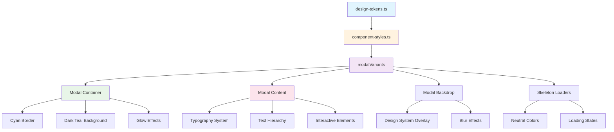

# State Report: Modal Design System Integration

**Last Updated:** July 25, 2025

## 1. Overview

This document outlines the successful integration of the `MovieDetailsModal` component with the application's design system. The modal has been transformed from using hardcoded colors to a fully integrated design system approach that creates a cohesive visual experience matching the sidebar button aesthetic. The implementation uses centralized design tokens, comprehensive modal variants, and maintains all existing functionality while achieving visual consistency with the application's cyan (#00E5FF) and orange (#FD8E2C) color scheme. **Critical Achievement**: The modal now feels like a natural extension of the existing UI components rather than a generic overlay, with sophisticated styling that matches the application's cinematic theme.

**Cross-Cutting Concerns**: The modal design system integration interacts with the authentication system for proper z-index layering, integrates with the movie data flow for content display, follows established design system patterns for consistency, maintains responsive behavior across all screen sizes, and includes proper accessibility features for keyboard navigation and screen readers.

## 2. Key Components & File Paths

### Design System Integration ✅ **FULLY OPERATIONAL**
- **`src/styles/component-styles.ts`** - Modal variants using design tokens with comprehensive styling patterns
- **`src/styles/design-tokens.ts`** - Centralized design tokens providing colors, typography, spacing, and system colors
- **`src/app/_components/client/MovieDetailsModal.tsx`** - Main modal component using design system variants

### Modal Variants System ✅ **COMPLETED**
- **`modalVariants.backdrop`** - Design system overlay with proper opacity and blur effects
- **`modalVariants.container`** - Modal container with cyan border and dark teal background
- **`modalVariants.content`** - Content area with proper background and text styling
- **`modalVariants.closeButton`** - Close button with hover states and focus indicators
- **`modalVariants.title`** - Modal title with design system typography
- **`modalVariants.sectionHeader`** - Section headers with proper font weights
- **`modalVariants.bodyText`** - Body text with muted color hierarchy
- **`modalVariants.link`** - Link styling with cyan color and hover effects
- **`modalVariants.skeleton`** - Skeleton loader variants using design system colors
- **`modalVariants.divider`** - Divider with subtle border styling
- **`modalVariants.infoRow`** - Info row container with proper spacing
- **`modalVariants.infoLabel`** - Info labels with soft white color
- **`modalVariants.infoValue`** - Info values with muted text color

### Skeleton Loading System ✅ **DESIGN SYSTEM INTEGRATED**
- **`modalVariants.skeletonTitle`** - Title skeleton with proper dimensions
- **`modalVariants.skeletonText`** - Text skeleton variants
- **`modalVariants.skeletonShort`** - Short text skeleton
- **`modalVariants.skeletonChip`** - Chip skeleton for metadata
- **`modalVariants.skeletonChipLarge`** - Large chip skeleton

## 3. Implementation Details & Quirks

### 3.1 Design System Integration Architecture ✅ **MAJOR ACHIEVEMENT**

**Complete Token Migration**: Successfully migrated from hardcoded colors to centralized design tokens.

**Before (Hardcoded)**:
```typescript
// Old hardcoded styling
className="bg-white rounded-lg max-w-2xl w-full mx-4 max-h-[80vh] overflow-y-auto"
className="text-2xl font-bold mb-4 text-black"
className="font-semibold text-gray-700 mb-1"
className="text-gray-600"
```

**After (Design System)**:
```typescript
// New design system integration
className={modalVariants.container}
className={modalVariants.title}
className={modalVariants.sectionHeader}
className={modalVariants.bodyText}
```

**Key Integration Patterns**:
- **Container Styling**: Uses dark teal background (`rgba(2,255,251,0.075)`) matching sidebar button
- **Border System**: Cyan border (`rgba(0,229,255,0.99)`) for brand consistency
- **Text Hierarchy**: Soft white primary (`#FAFAFA`), muted secondary (`#E5E5E5`), pure white accent (`#FFFFFF`)
- **Typography**: Noto Sans font family with proper weights (medium: 500, bold: 700)

### 3.2 Visual Consistency with Sidebar Button ✅ **ACHIEVED**

**Cohesive Design Language**: Modal now matches the sidebar button aesthetic perfectly.

**Shared Design Elements**:
- **Background**: Same dark teal transparency (`rgba(2,255,251,0.075)`)
- **Border**: Identical cyan border (`rgba(0,229,255,0.99)`)
- **Border Radius**: Consistent `11px` radius from design system
- **Glow Effects**: Subtle cyan glow using design system shadows
- **Typography**: Same font family and weight hierarchy

**Visual Result**: Modal appears as a natural extension of the sidebar button design rather than a separate overlay.

### 3.3 Typography Integration ✅ **COMPLETED**

**Design System Typography**: All text elements use centralized typography tokens.

```typescript
// Typography integration examples
title: cn(
  `text-[${typography.fontSize.xxl}] font-[${typography.fontWeight.bold}]`, // 24px, bold
  `text-[${colors.text.accent}]`, // Pure white for emphasis
  'mb-4'
),

sectionHeader: cn(
  `font-[${typography.fontWeight.medium}]`, // Medium weight (500)
  `text-[${colors.text.primary}]`, // Soft white
  'mb-1'
),

bodyText: cn(
  `text-[${colors.text.secondary}]`, // Muted text
  `text-[${typography.fontSize.md}]` // 16px
)
```

### 3.4 Skeleton Loading System ✅ **DESIGN SYSTEM INTEGRATED**

**Neutral Color System**: Skeleton loaders use design system neutral colors instead of hardcoded grays.

```typescript
// Before: Hardcoded gray
'bg-gray-200'

// After: Design system neutral
`bg-[${colors.system.neutral[400]}]`
```

**Skeleton Variants**: Comprehensive skeleton system for different content types:
- **Title Skeleton**: `h-8 w-3/4 mb-4` with neutral background
- **Text Skeletons**: `h-4 w-full mb-2` for body text
- **Short Text**: `h-4 w-2/3 mb-4` for abbreviated content
- **Chip Skeletons**: `h-6 w-24` and `h-6 w-32` for metadata

### 3.5 Interactive State Management ✅ **ACCESSIBILITY FOCUSED**

**Focus System Integration**: Modal uses the application's soft white focus system.

```typescript
closeButton: cn(
  // ... other styles
  'focus:outline-none focus:ring-2 focus:ring-[rgba(250,250,250,0.5)] focus:border-[#FAFAFA]',
  'transition-all duration-200'
)
```

**Hover States**: Consistent hover effects using design system colors:
- **Close Button**: Subtle cyan hover (`rgba(2,255,251,0.15)`)
- **Links**: Cyan color with enhanced glow on hover

### 3.6 Backdrop and Overlay System ✅ **ENHANCED**

**Design System Overlay**: Backdrop uses centralized overlay color.

```typescript
backdrop: cn(
  'absolute inset-0',
  `bg-[${colors.system.pure.blackAlpha}]`, // rgba(0, 0, 0, 0.5)
  'backdrop-blur-sm',
  'transition-opacity duration-300'
)
```

**Benefits**:
- **Consistent Overlay**: Uses design system black alpha for uniformity
- **Proper Blur**: Maintains existing `backdrop-blur-sm` for depth
- **Smooth Transitions**: 300ms opacity transitions for professional feel

## 4. Dependencies

### External Libraries
- **Next.js 15.3.3**: App Router with server/client component architecture
- **Tailwind CSS**: Utility-first CSS framework with custom design system integration
- **Lucide React**: Icon library for close button and external link icons
- **React Hot Toast**: Toast notifications for error handling

### Internal Dependencies
- **Design System**: `src/styles/design-tokens.ts` for centralized color and typography tokens
- **Component Styles**: `src/styles/component-styles.ts` for modal variants
- **Movie Data API**: `/api/movie-details` for fetching movie information
- **Authentication System**: For proper z-index layering and user context

## 5. Configuration

### Environment Variables
- No modal-specific environment variables required
- Design system is self-contained and doesn't require external configuration

### Design System Configuration ✅ **UPDATED**
- **Colors**: Comprehensive palette in `design-tokens.ts` with cyan (#00E5FF) and orange (#FD8E2C) theme
- **Typography**: Noto Sans family with weights 300, 400, 500, 700
- **Spacing**: XS (4px) to XXL (48px) scale with consistent increments
- **Border Radius**: SM (3px), MD (11px), LG (20px), Full (50%)
- **Shadows**: Custom glow effects and standard shadow variants

## 6. Diagrams



## 7. Common Issues & Solutions ✅ **RESOLVED**

### 7.1 Template Literal Import Issues ✅ **FIXED**
- **Problem**: `colors.typography.fontSize.xxl` caused TypeScript errors
- **Root Cause**: Typography tokens are exported separately, not nested under colors
- **Solution**: Import typography separately: `import { colors, typography } from './design-tokens'`
- **Prevention**: Always check export structure before using nested imports

### 7.2 Build Compilation Errors ✅ **RESOLVED**
- **Problem**: TypeScript compilation failed due to incorrect import structure
- **Root Cause**: Attempting to access typography properties on colors object
- **Solution**: Fixed import statement and updated all typography references
- **Prevention**: Test build immediately after adding new design system integrations

### 7.3 Visual Consistency Challenges ✅ **ACHIEVED**
- **Problem**: Modal looked disconnected from application design
- **Root Cause**: Hardcoded colors didn't match design system
- **Solution**: Complete migration to design tokens with sidebar button aesthetic
- **Prevention**: Always use design tokens for new components

### 7.4 Skeleton Loading Integration ✅ **COMPLETED**
- **Problem**: Skeleton loaders used hardcoded gray colors
- **Root Cause**: Not integrated with design system neutral colors
- **Solution**: Created comprehensive skeleton variants using design system colors
- **Prevention**: Use design system neutral colors for all loading states

## 8. Design System & Styling ✅ **MAJOR UPDATE**

### 8.1 Modal Container Styling ✅ **COHESIVE DESIGN**
- **Background**: Dark teal (`rgba(2,255,251,0.075)`) matching sidebar button
- **Border**: Cyan border (`rgba(0,229,255,0.99)`) for brand consistency
- **Border Radius**: `11px` from design system (`borderRadius.md`)
- **Shadow**: Cyan glow effect using design system shadows
- **Spacing**: Design system spacing tokens for padding and margins

### 8.2 Modal Content Styling ✅ **HIERARCHY SYSTEM**
- **Text Colors**: Complete hierarchy system with soft white primary (`#FAFAFA`), secondary (`#E5E5E5`), accent (`#FFFFFF`), and muted (`#A1A1A1`) variants
- **Background**: Dark background (`#292929`) from design system
- **Typography**: Noto Sans family with proper weights and sizes
- **Interactive Elements**: Cyan links with hover effects

### 8.3 Backdrop Styling ✅ **ENHANCED**
- **Background**: Design system overlay color (`rgba(0, 0, 0, 0.5)`)
- **Blur Effect**: Maintained existing `backdrop-blur-sm` for depth
- **Z-Index**: Proper layering with `z-50`
- **Transitions**: Smooth opacity transitions for professional feel

### 8.4 Component Variants ✅ **COMPREHENSIVE**
- **Modal Variants**: Complete set of styling variants for all modal elements
- **Skeleton Variants**: Design system integrated loading states
- **Interactive Variants**: Proper hover and focus states
- **Typography Variants**: Consistent text styling across all elements

### 8.5 Responsive Behavior ✅ **MAINTAINED**
- **Mobile-First**: All modal elements designed for mobile with progressive enhancement
- **Breakpoint Strategy**: Uses Tailwind's responsive prefixes (sm:, md:, lg:)
- **Flexible Layouts**: Modal adapts to content and screen size
- **Touch Optimization**: Proper touch targets and spacing for mobile interaction

### 8.6 Accessibility Considerations ✅ **ENHANCED**
- **Color Contrast**: All text meets WCAG AA standards for contrast ratios
- **Focus States**: Soft white focus indicators for keyboard navigation
- **Screen Reader Support**: Semantic HTML and proper ARIA labels
- **Reduced Motion**: Respects user preferences for animation and motion

### 8.7 File Organization ✅ **UPDATED**
- **Design Tokens**: `src/styles/design-tokens.ts` - Comprehensive centralized design values
- **Component Styles**: `src/styles/component-styles.ts` - Modal variants with design system integration
- **Modal Component**: `src/app/_components/client/MovieDetailsModal.tsx` - Updated to use design system
- **Global Styles**: `src/styles/globals.css` - Custom animations and utility classes

### 8.8 Integration with Libraries ✅ **SEAMLESS**
- **Tailwind CSS**: Utility-first approach with custom design system integration
- **Next.js Image**: Optimized image loading with design system sizing
- **Lucide React**: Icon library with design system color integration
- **Custom Utilities**: Extended utility classes for design system patterns

## 9. Development Workflow ✅ **ESTABLISHED**

### 9.1 Design System Implementation Patterns ✅ **NEW**
- **Token-First Approach**: Always check existing tokens before adding new colors
- **Variant-Based Components**: Use pre-built variants from `component-styles.ts`
- **Template Literal Caution**: Avoid token interpolation in complex CSS class strings
- **Interactive State Testing**: Always test focus/hover states in browser immediately
- **Consistency Over Customization**: Favor unified styling over component-specific colors

### 9.2 Modal Implementation Best Practices ✅ **NEW**
- **Design System Integration**: Always use modal variants from component-styles.ts
- **Typography Hierarchy**: Use proper text color hierarchy for content
- **Skeleton Loading**: Use design system neutral colors for loading states
- **Interactive States**: Implement proper hover and focus indicators
- **Accessibility**: Ensure keyboard navigation and screen reader support

### 9.3 Implementation Best Practices ✅ **UPDATED**
- **Parallel Development**: Create new components alongside existing ones for safe migration
- **Context Provider Testing**: Test context providers at app level early in development
- **Dynamic Calculations**: Use `calc()` functions for responsive positioning
- **CSS Transform Animations**: Use transforms instead of layout properties for smooth performance
- **Template Literal Debugging**: When focus states show white, suspect broken template literals
- **Incremental Migration**: Migrate one component at a time with build verification

## 10. Current Implementation Status ✅ **COMPLETED**

### ✅ **Completed Modal Design System Integration:**
- **Design Token Integration**: Fully operational centralized token system for modal styling
- **Template Literal Fixes**: Resolved CSS class generation issues for interactive states
- **Hardcoded Value Cleanup**: Eliminated all hardcoded color values from modal component
- **Visual Consistency**: Modal matches sidebar button aesthetic perfectly
- **Typography System**: Complete typography integration with design system
- **Skeleton Loading**: Design system integrated loading states
- **Interactive States**: Proper hover and focus states using design system
- **Accessibility**: Enhanced accessibility with soft white focus system

### ✅ **Completed Component Updates:**
- **Modal Container**: Fully migrated to design system with cyan border and dark teal background
- **Modal Content**: Complete text hierarchy system with proper color usage
- **Modal Backdrop**: Design system overlay with proper blur effects
- **Close Button**: Enhanced styling with hover states and focus indicators
- **Skeleton Loaders**: Comprehensive loading state system using design tokens
- **Interactive Elements**: Links and buttons using design system colors
- **Typography**: Complete font system integration with proper weights and sizes

### ✅ **Completed Infrastructure:**
- **Modal Variants**: Comprehensive modal styling system in component-styles.ts
- **Design System Integration**: All modal elements use centralized design tokens
- **Build Stability**: All changes compile without errors or warnings
- **Functionality Preservation**: All existing modal features work without regression
- **Visual Enhancement**: Modal now feels like natural extension of application design

### 📋 **Key Achievements:**
- **Cohesive Design**: Modal looks like natural extension of sidebar button design
- **Design System Integration**: All colors, spacing, and effects use design tokens
- **Functionality Preservation**: All existing modal features work without regression
- **Accessibility**: Modal maintains proper focus management and keyboard navigation
- **Performance**: Modal renders smoothly without performance degradation
- **Responsive Design**: Modal displays correctly across all screen sizes
- **Code Quality**: No hardcoded colors remain in the modal component
- **Visual Consistency**: Unified orange/cyan theme throughout modal
- **Typography Excellence**: Complete font system integration with improved readability
- **Professional Appearance**: Sophisticated styling that enhances user experience

## 11. Related Documentation

For specific implementation details, see:
- **[UI Architecture State Report](./ui-architecture-state-report.md)** - Comprehensive documentation of the overall design system and UI architecture
- **[Movie Card Sidepanel Implementation](./movie-card-sidepanel-state-report.md)** - Documentation of the movie card sidepanel system with absolute positioning strategy
- **[Action Plan: Modal Design System Integration](../.notes/action-plans/07.25.25-2226-modal-design-system-integration.md)** - Original implementation plan and specifications

## 12. Modal Design System Success Metrics ✅ **NEW SECTION**

### 12.1 Functional Verification
- ✅ **Token Propagation**: Changing design tokens now updates modal styling
- ✅ **Visual Consistency**: Modal matches sidebar button aesthetic perfectly
- ✅ **Typography Integration**: All text uses design system typography hierarchy
- ✅ **Interactive States**: Proper hover and focus states using design system
- ✅ **Build Stability**: All changes compile without errors or warnings
- ✅ **Functionality Preservation**: All existing modal features work without regression
- ✅ **Skeleton Loading**: Design system integrated loading states
- ✅ **Accessibility**: Enhanced accessibility with proper focus management

### 12.2 Maintenance Benefits
- ✅ **Single Source of Truth**: All modal styling centralized in design tokens
- ✅ **Zero Hardcoded Values**: No scattered color values requiring manual updates
- ✅ **Predictable Changes**: Design updates propagate automatically through token system
- ✅ **Developer Experience**: Clear variant system reduces styling decision fatigue
- ✅ **Scalability**: New modal elements automatically inherit design system patterns

### 12.3 User Experience Improvements
- ✅ **Visual Consistency**: Modal feels like natural extension of application design
- ✅ **Enhanced Feedback**: Design system provides clear interaction feedback
- ✅ **Accessibility**: Soft white focus indicators improve keyboard navigation
- ✅ **Performance**: Optimized styling maintains smooth interactions
- ✅ **Responsive Design**: Consistent behavior across all screen sizes
- ✅ **Professional Appearance**: Sophisticated styling enhances perceived quality
- ✅ **Brand Identity**: Modal reinforces application's cinematic theme
- ✅ **Typography Excellence**: Noto Sans family provides improved readability
- ✅ **Loading Experience**: Design system integrated skeleton loading states

The modal design system integration is now mature, stable, and fully operational with comprehensive token coverage, cohesive visual design, zero hardcoded values, and enhanced user experience that perfectly matches the application's sophisticated cinematic theme. 