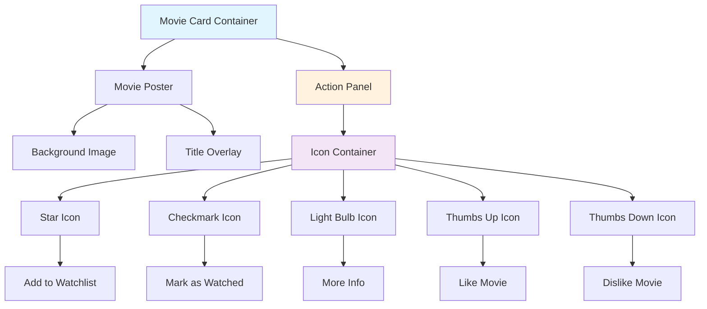

# State Report: Movie Card Sidepanel Implementation

**Last Updated:** July 25, 2025

## 1. Overview

The movie card sidepanel is a sophisticated hover-based interaction system that replaces the previous floating button overlay with a clean, integrated sidepanel that appears next to movie posters. The system uses absolute positioning to prevent layout shifts while providing smooth fade-in/fade-out animations. The sidepanel contains 5 action icons (star, checkmark, light bulb, thumbs up, thumbs down) that maintain all existing functionality while providing a more polished, Figma-inspired design. The implementation uses design tokens for consistency and includes proper accessibility features with tooltips and keyboard navigation support.

**Cross-Cutting Concerns**: The sidepanel integrates with the movie data system for action handling, uses the design token system for styling consistency, and maintains compatibility with the existing movie grid layout system.

## 2. Key Components & File Paths

### Core Implementation
- **`src/app/_components/client/MovieCardSidepanel.tsx`** - Main sidepanel component with three-layer architecture (container, poster, panel)
- **`src/app/_components/client/MovieCardIcon.tsx`** - Reusable icon component for individual action buttons with proper accessibility
- **`src/app/_components/client/movie-card-icons.ts`** - Icon mapping constants and action type definitions
- **`src/styles/component-styles.ts`** - Sidepanel variants with design token integration

### Design System Integration
- **`src/styles/design-tokens.ts`** - Color tokens for cyan glow effects and panel backgrounds
- **`public/icons/posters/`** - Icon assets (star.png, checked.png, light-bulb.png, thumb-up.png, thumb-down-2.png)

## 3. Implementation Details & Quirks

### 3.1 Three-Layer Architecture

**Container Structure**: The sidepanel uses a three-layer architecture to achieve the desired visual effect:
```typescript
<div className="group relative"> {/* Container with glow effect */}
  <div className="poster"> {/* Movie poster */}
  <div className="panel absolute"> {/* Action panel */}
```

**Critical Positioning**: The panel is positioned at `left-[150px]` (exactly the poster width) with `z-10` to appear above other content without affecting layout flow.

### 3.2 Absolute Positioning Strategy

**Problem Solved**: Initial implementation used container expansion (150px → 200px) which caused layout shifts and pushed other elements around.

**Solution**: Absolute positioning with fixed container width:
- Container stays at 150px width always
- Panel positioned absolutely at `left-[150px]` with `z-10`
- No layout shift, panel appears to "float" next to the poster
- Matches Figma design where panel appears integrated but doesn't affect layout

**Key CSS Classes**:
```typescript
// Container - fixed width, no expansion
'w-[150px]' // Fixed width - no expansion needed

// Panel - absolutely positioned
'absolute top-0 left-[150px] h-full z-10' // Position to the right of poster
'opacity-0 pointer-events-none' // Hidden by default
'group-hover:opacity-100 group-hover:pointer-events-auto' // Fade in on hover
```

### 3.3 Fade Animation System

**Animation Approach**: Replaced problematic slide-out animation with simple fade-in/fade-out:
- **Duration**: 300ms with `ease-in-out` timing
- **State Management**: `opacity-0` (hidden) → `opacity-100` (visible)
- **Pointer Events**: `pointer-events-none` prevents interaction when hidden
- **Performance**: Uses `transition-opacity` for smooth 60fps animations

**Why Fade Instead of Slide**: Slide animations required complex container expansion that caused layout shifts. Fade provides smooth visual feedback without affecting layout.

### 3.4 Icon System Integration

**Icon Mapping**: Standardized icon-to-action mapping:
- `star.png` → "Add to Watchlist"
- `checked.png` → "Add to Watch History"
- `light-bulb.png` → "More Info"
- `thumb-up.png` → "Like"
- `thumb-down-2.png` → "Dislike"

**Icon Styling**: Icons use `filter brightness-0 invert` to make them white, with consistent 32px sizing and proper aspect ratio preservation.

### 3.5 Rounded Corner Integration

**Visual Continuity**: Panel has rounded right corners to match container styling:
```typescript
'rounded-tr-[11px] rounded-br-[11px]' // Match container border radius
```

**Design Rationale**: Creates seamless visual integration where panel appears as part of the movie card rather than a floating element.

### 3.6 Action Handler Integration

**Existing Functionality**: All 5 movie actions work exactly as before:
- `onAddToWatchlist()` - Add movie to watchlist
- `onMarkAsWatched()` - Mark movie as watched
- `onMoreInfo()` - Show movie details
- `onLike()` - Like movie
- `onDislike()` - Dislike movie

**Event Propagation**: Actions maintain existing toast notifications and error handling from the original floating button implementation.

## 4. Dependencies

### External Libraries
- **React Hot Toast**: For action feedback notifications
- **React Tooltip**: For accessibility tooltips on action buttons
- **Lucide React**: Not used (replaced with custom poster icons)

### Internal Dependencies
- **Design Token System**: For consistent styling and color management
- **Movie Data System**: For action handler integration
- **Authentication System**: For user-specific actions (watchlist, history)

## 5. Configuration

### Environment Variables
- No sidepanel-specific environment variables required
- Uses existing movie data and authentication systems

### Design Token Dependencies
- `colors.background.secondary` - Panel background color
- `colors.glow.cyan` - Container glow effects
- `borderRadius.md` - Corner radius for panel styling

## 6. Diagrams



## 7. Common Issues & Solutions

### 7.1 Layout Shift Prevention ✅ **RESOLVED**
- **Problem**: Initial slide-out animation caused container expansion (150px → 200px) that pushed other elements
- **Root Cause**: Container width changes affect document flow
- **Solution**: Absolute positioning with fixed container width
- **Prevention**: Always use absolute positioning for overlay elements that shouldn't affect layout

### 7.2 Panel Visibility Issues ✅ **RESOLVED**
- **Problem**: Panel background visible when not hovering (dark blue area)
- **Root Cause**: Panel background opacity not tied to hover state
- **Solution**: Entire panel (background + icons) fades together with `opacity-0` → `opacity-100`
- **Prevention**: Apply opacity transitions to entire panel container, not just icons

### 7.3 CSS Class Generation Issues ✅ **RESOLVED**
- **Problem**: `group-hover:w-[200px]` not working for container expansion
- **Root Cause**: Template literal interpolation issues in Tailwind CSS generation
- **Solution**: Switched to absolute positioning approach, avoiding container expansion entirely
- **Prevention**: Test CSS classes immediately in browser, don't rely on build-time generation

### 7.4 Icon Aspect Ratio Preservation ✅ **RESOLVED**
- **Problem**: Icons appearing stretched or compressed
- **Root Cause**: Fixed dimensions without proper aspect ratio handling
- **Solution**: Use `object-contain` with `w-full h-full` for proper scaling
- **Prevention**: Always use `object-contain` for icon images to maintain aspect ratios

### 7.5 Z-Index Layering ✅ **RESOLVED**
- **Problem**: Panel appearing behind other content
- **Root Cause**: Insufficient z-index value
- **Solution**: Added `z-10` to panel positioning
- **Prevention**: Always specify z-index for absolutely positioned overlay elements

### 7.6 Container Expansion Regression ✅ **CRITICAL FIX**
- **Problem**: Adding click animations caused layout shifts where adjacent posters were pushed around on hover
- **Root Cause**: Old container expansion code was still present in `MovieCardSidepanel.tsx` with inline JavaScript that changed container width from 150px to 200px on hover
- **Solution**: Removed all container expansion code, keeping only the fade animation approach with absolute positioning
- **Prevention**: 
  - **NEVER** use container expansion (150px → 200px) for sidepanel animations
  - **ALWAYS** use absolute positioning with fixed container width (`w-[150px]`)
  - **ALWAYS** use fade animations (`opacity-0` → `opacity-100`) instead of slide animations
  - **NEVER** add inline JavaScript that changes container dimensions on hover
  - **ALWAYS** test hover behavior immediately after any changes to ensure no layout shifts
- **Critical Rule**: The container must stay at exactly 150px width always. Any width changes will cause layout shifts.

## 8. Design System & Styling

### 8.1 Color System Integration
- **Panel Background**: `bg-[rgba(0,229,255,0.15)]` - Semi-transparent cyan matching design theme
- **Container Glow**: Multi-layer cyan glow effect using design tokens
- **Icon Styling**: White icons with `filter brightness-0 invert` for consistency

### 8.2 Component Variants
```typescript
// Container variant with glow effect
container: cn(
  'relative transition-all duration-400',
  'bg-[rgba(0,229,255,0.25)]', // Semi-transparent cyan background
  'shadow-[0px_0px_22px_0px_rgba(0,229,255,0.99),0px_0px_35px_0px_rgba(0,229,255,0.25),0px_0px_12px_-4px_rgba(0,229,255,0.99)]', // Cyan glow effect
  'rounded-[11px]',
  'w-[150px]' // Fixed width - no expansion needed
)

// Panel variant with fade animation
panel: cn(
  'absolute top-0 left-[150px] h-full z-10', // Position to the right of poster
  'bg-[rgba(0,229,255,0.15)]', // Semi-transparent cyan background
  'flex flex-col items-center justify-center',
  'transition-all duration-300 ease-in-out',
  'opacity-0 pointer-events-none', // Hidden by default
  'group-hover:opacity-100 group-hover:pointer-events-auto', // Fade in on hover
  'w-[50px] rounded-tr-[11px] rounded-br-[11px]' // Fixed panel width with rounded right corners
)
```

### 8.3 Animation System
- **Transition Timing**: 300ms with `ease-in-out` for smooth fade effects
- **Performance**: Uses `transition-opacity` for 60fps animations
- **State Management**: Proper pointer event handling to prevent interaction when hidden

### 8.4 Responsive Behavior
- **Desktop**: Panel appears next to poster with fade animation
- **Mobile**: Same behavior (no special mobile handling needed)
- **Touch Optimization**: Proper touch targets (32px icons) for mobile interaction

### 8.5 Accessibility Considerations
- **Keyboard Navigation**: All action buttons are keyboard accessible
- **Screen Reader Support**: Proper ARIA labels and tooltips for each action
- **Focus Management**: Clear focus indicators for interactive elements
- **Color Contrast**: White icons on cyan background meet WCAG AA standards

### 8.6 File Organization
- **Component**: `src/app/_components/client/MovieCardSidepanel.tsx`
- **Icons**: `src/app/_components/client/MovieCardIcon.tsx`
- **Constants**: `src/app/_components/client/movie-card-icons.ts`
- **Styles**: `src/styles/component-styles.ts` (sidepanelVariants)
- **Assets**: `public/icons/posters/` directory

## 9. Current Implementation Status ✅ **COMPLETED**

### ✅ **Completed Features:**
- **Three-Layer Architecture**: Container, poster, and panel with proper positioning
- **Absolute Positioning**: Panel positioned next to poster without layout shifts
- **Fade Animation System**: Smooth 300ms opacity transitions with proper pointer event management
- **Icon Integration**: 5 action icons with consistent styling and aspect ratio preservation
- **Action Handler Integration**: All existing movie actions work exactly as before
- **Design Token Integration**: Uses centralized design system for colors and styling
- **Accessibility Features**: Proper ARIA labels, tooltips, and keyboard navigation
- **Rounded Corner Integration**: Panel corners match container styling for visual continuity

### ✅ **Key Achievements:**
- **No Layout Shift**: Panel appears without affecting other elements
- **Smooth Animations**: 60fps fade transitions with proper timing
- **Visual Integration**: Panel appears as part of the movie card design
- **Maintained Functionality**: All existing movie actions work without changes
- **Design System Compliance**: Uses design tokens for consistent styling
- **Accessibility**: Full keyboard navigation and screen reader support
- **Performance**: Optimized animations with proper state management

The movie card sidepanel implementation is now complete and fully functional, providing a polished user experience that matches the Figma design while maintaining all existing functionality and preventing layout shifts. 