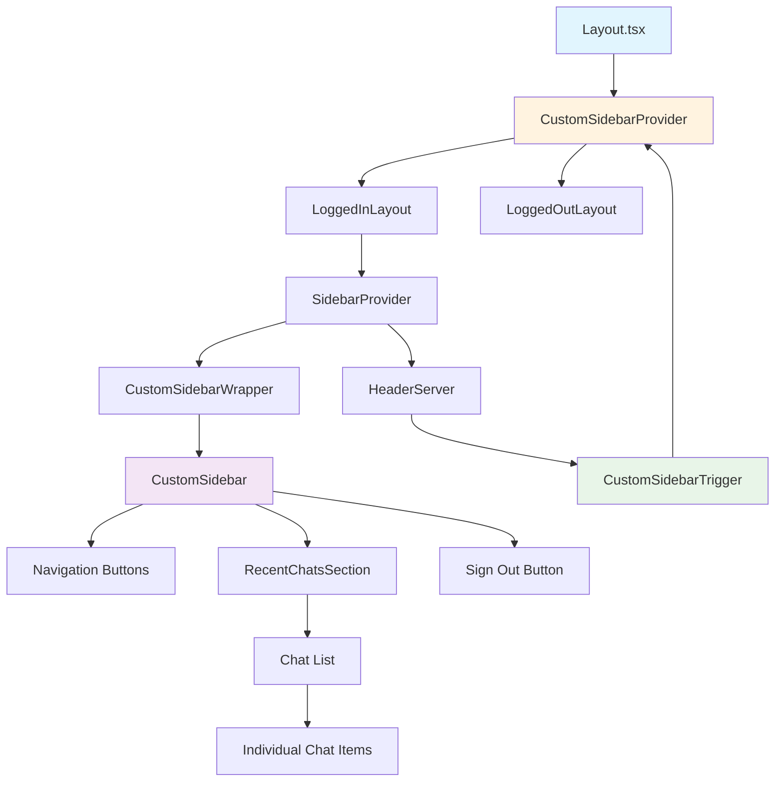

# State Report: UI Architecture & Design System

**Last Updated:** 2025-07-20

## 1. Overview

This document outlines the complete UI architecture and design system implementation for the application. The system has been refactored to match a Figma design system with a dark theme featuring cyan (#00E5FF) and orange (#FD8E2C) color scheme. The application uses a hybrid architecture with Next.js App Router, server/client component separation, shadcn/ui components, and custom design tokens. The UI includes sophisticated features like glowing effects, custom sidebar implementation, image-based logos, and responsive design patterns. The design system is centralized through design tokens and component styles, enabling consistent theming across all components.

**Cross-Cutting Concerns**: The UI architecture interacts with the authentication system for conditional rendering, integrates with the chat system for dynamic content, follows established design system patterns, and maintains responsive behavior across all screen sizes.

## 2. Key Components & File Paths

### Design System Foundation
- **`src/styles/design-tokens.ts`** - Centralized design tokens for colors, spacing, typography, shadows, and layout dimensions
- **`src/styles/component-styles.ts`** - Pre-built component variants and utility classes for consistent styling
- **`src/components/ui/button-magic.tsx`** - Design system button variants integration

### Layout & Navigation Components
- **`src/app/layout.tsx`** - Main layout with sidebar provider and responsive structure
- **`src/app/_components/server/HeaderServer.tsx`** - Server-side header with image-based logo
- **`src/app/_components/client/HeaderClient.tsx`** - Client-side header with authentication and sidebar trigger
- **`src/components/ui/custom-sidebar-trigger.tsx`** - Custom sidebar button with orange hamburger icon

### Custom Sidebar Implementation
- **`src/components/ui/custom-sidebar.tsx`** - Main sidebar component with fixed positioning and cyan outline styling
- **`src/components/ui/custom-sidebar-context.tsx`** - React context for sidebar open/close state management
- **`src/app/_components/client/CustomSidebarWrapper.tsx`** - Client wrapper component for data fetching and session management
- **`src/app/_components/client/RecentChatsSection.tsx`** - Component for displaying recent chats with expandable functionality

### Asset Management
- **`public/icons/sidebar/side-bar.png`** - Custom sidebar hamburger icon
- **`public/title/main-title-horizontal-v2png.png`** - Application logo

## 3. Implementation Details & Quirks

### 3.1 Design System Architecture

**Centralized Token System**: The design system uses a two-layer approach with design tokens and component styles.

- **Design Tokens** (`design-tokens.ts`): Raw values for colors, spacing, typography, shadows, and layout dimensions
- **Component Styles** (`component-styles.ts`): Pre-built variants that use design tokens for consistent theming
- **Integration Pattern**: Components import from `component-styles.ts` rather than using design tokens directly

**Critical Detail**: The design system is comprehensive and includes:
- Complete color palette with cyan/orange theme
- Typography system with font families, sizes, and weights
- Spacing scale from XS to XXL
- Layout dimensions for all major components
- Shadow system with glow effects
- Animation utilities

### 3.2 Next.js Image Component Sizing Issues

**Complex Sizing Behavior**: Next.js Image component has non-intuitive sizing behavior that caused significant implementation challenges.

- **Props vs CSS Classes**: `width` and `height` props are for image quality, not display size
- **Auto Sizing Conflict**: `h-auto w-auto` in className overrides width/height props completely
- **Solution Pattern**: Use CSS classes for display size, props for quality optimization
- **Responsive Approach**: Use `object-contain` for aspect ratio preservation, fixed dimensions for exact sizing

**Example of Correct Implementation:**
```tsx
<Image 
  src="/title/main-title-horizontal-v2png.png"
  width={400} height={100}  // For quality
  className="h-[190px] w-auto object-contain"  // For display
/>
```

### 3.3 Server/Client Component Separation

**Architecture Pattern**: The application uses strict server/client component separation for optimal performance.

- **Server Components**: Handle data fetching, authentication, and static rendering
- **Client Components**: Handle interactivity, state management, and user interactions
- **Integration Pattern**: Server components pass data to client components through props
- **Authentication Flow**: Server components handle session management, client components handle UI interactions

**Critical Detail**: The sidebar trigger is a client component but integrates with server-side sidebar context through the `useSidebar` hook.

### 3.4 React Context Best Practices

**Context Provider Scope**: Context providers must wrap the entire application at the layout level to ensure availability to all components.

- **App-Level Providers**: CustomSidebarProvider wraps entire app in layout.tsx
- **Conditional Context Usage**: Avoid conditional context usage to prevent hook violations
- **Clear Separation**: Different context purposes should be clearly separated

**Example Implementation:**
```tsx
// In layout.tsx
<CustomSidebarProvider>
  {isLoggedIn ? loggedInLayout : loggedOutLayout}
</CustomSidebarProvider>
```

### 3.5 Dynamic Positioning System

**Responsive Layout Calculations**: Components use `calc()` functions for positioning to account for dynamic dimensions.

- **Header-Relative Positioning**: Sidebar positioned relative to header height
- **Dynamic Height Calculations**: Components adapt to different screen sizes
- **Layout Shift Prevention**: Fixed positioning with CSS transforms for animations

**Example Implementation:**
```tsx
style={{
  top: 'calc(123px + 32px)',
  height: 'calc(100vh - 123px - 64px)',
  transform: isOpen ? 'translateX(0)' : 'translateX(-100%)'
}}
```

### 3.6 Third-Party Component Integration

**Design System Integration**: Third-party components require special consideration for design system integration.

- **CSS Variables Synchronization**: Third-party components rely on CSS variables in `globals.css`, which must be synchronized with design tokens
- **Hybrid Styling Approach**: The application uses direct hex values for custom components and CSS variables for third-party components
- **Component-Specific Styling**: Some third-party components (like AuthCard) have complex internal structures requiring specific class name targeting

**Critical Detail**: CSS variables in `globals.css` must match design tokens exactly to ensure third-party components use the correct colors. See **[Auth System State Report](./auth-system-state-report.md#35-ui-component-styling-challenges)** for detailed AuthCard styling patterns and limitations.

### 3.6 Authentication State Integration

**Conditional Rendering**: The UI adapts based on authentication state with proper fallbacks.

- **Signed In**: Shows logout button and full sidebar functionality
- **Signed Out**: Shows sign-in button and limited sidebar functionality
- **Auth Pages**: Hides auth buttons to prevent UI conflicts
- **Responsive Behavior**: Maintains layout integrity across all states

**Implementation Pattern:**
```tsx
const renderAuthButtons = () => {
  if (user) {
    return <LogoutButton />
  }
  if (pathname.startsWith('/auth')) {
    return null
  }
  return <SignInButton />
}
```

### 3.7 CSS Transform Animations

**Performance-Optimized Animations**: Uses `transform: translateX()` for slide animations instead of changing layout properties.

- **Smooth Performance**: No layout recalculations during animations
- **Consistent Timing**: `duration-300 ease-in-out` for optimal user experience
- **Cross-Browser Compatibility**: CSS transforms work consistently across browsers

## 4. Dependencies

### External Libraries
- **Next.js 15.3.3**: App Router with server/client component architecture
- **Tailwind CSS**: Utility-first CSS framework with custom design system integration
- **shadcn/ui**: Component library with design system customization
- **React Query** (TanStack Query): For client-side data fetching and caching
- **React Context API**: For state management across components
- **Lucide React**: Icon library for navigation and UI elements
- **React Hot Toast**: Toast notifications for user feedback

### Internal Dependencies
- **Authentication System**: For session management and user state
- **tRPC API**: For fetching data and API communication
- **Design System**: For colors, spacing, and typography tokens
- **Header Component**: For sidebar toggle functionality

## 5. Configuration

### Environment Variables
- No UI-specific environment variables required
- Design system is self-contained and doesn't require external configuration

### Design System Configuration
- **Colors**: Defined in `design-tokens.ts` with cyan (#00E5FF) and orange (#FD8E2C) theme
- **Typography**: Noto Sans and Noto Sans Display font families
- **Spacing**: XS to XXL scale with consistent increments
- **Shadows**: Custom glow effects and standard shadow variants
- **Layout**: Component-specific dimensions for header (123px), sidebar (293px), etc.

## 6. Diagrams



## 7. Common Issues & Solutions

### 7.1 Image Sizing Problems
- **Problem**: Changing width/height props has no effect on display size
- **Root Cause**: `h-auto w-auto` in className overrides width/height props
- **Solution**: Remove auto sizing and use fixed CSS classes with `object-contain`
- **Prevention**: Always use CSS classes for display size, props for quality

### 7.2 Context Provider Errors
- **Problem**: "useCustomSidebar must be used within a CustomSidebarProvider"
- **Root Cause**: Context provider not wrapping entire application
- **Solution**: Move CustomSidebarProvider to wrap the entire app in layout.tsx
- **Prevention**: Always place context providers at the highest necessary level

### 7.3 React Hooks Violations
- **Problem**: Conditional hook calls causing React errors
- **Root Cause**: Hooks called conditionally or in wrong order
- **Solution**: Call hooks unconditionally and use conditional logic within the hooks themselves
- **Prevention**: Follow React hooks rules strictly, especially in conditional rendering

### 7.4 Layout Shifts
- **Problem**: Components affecting layout of other components
- **Root Cause**: Using layout properties for animations instead of transforms
- **Solution**: Use fixed positioning with dynamic height calculations and CSS transforms
- **Prevention**: Always use transforms for animations, never layout properties

### 7.5 Component Compression Issues
- **Problem**: Custom components appearing compressed or misaligned
- **Root Cause**: Container size not accommodating content size
- **Solution**: Ensure container dimensions can fit content dimensions
- **Prevention**: Test component sizing during development, not just at completion

## 8. Design System & Styling

### 8.1 Color System
- **Primary Colors**: Cyan (#00E5FF) and Orange (#FD8E2C) for brand identity
- **Background Colors**: Dark theme with `#0a0a0b` main background and `#292929` secondary
- **Text Colors**: White primary text with proper contrast ratios
- **Border Colors**: Orange primary border with cyan secondary border
- **Glow Effects**: Custom glow colors for cyan, orange, and gold effects

### 8.2 Typography Hierarchy
- **Font Families**: Noto Sans for body text, Noto Sans Display for headings
- **Font Sizes**: XS (14px) to XXL (24px) with consistent scale
- **Font Weights**: Normal (400), Medium (500), Bold (700)
- **Line Heights**: Tight (1.2), Normal (1.5), Relaxed (1.8)

### 8.3 Component Variants
- **Button Variants**: Primary (orange outline), Chip (orange glow), Sidebar (cyan outline)
- **Card Variants**: Movie (cyan glow), Chat (orange border), Sidebar (cyan border)
- **Input Variants**: Chat (dark background), Search (transparent background)
- **Chip Variants**: Conversation (orange glow), Tag (cyan background)

### 8.4 Layout System
- **Container Dimensions**: Header (123px), Sidebar (293px), Chat (358px), Movie cards (141x212px)
- **Spacing Scale**: XS (4px) to XXL (48px) with consistent increments
- **Border Radius**: SM (3px), MD (11px), LG (20px), Full (50%)
- **Shadow System**: Glow effects and standard shadows with proper layering

### 8.5 Responsive Behavior
- **Mobile-First**: All components designed for mobile with progressive enhancement
- **Breakpoint Strategy**: Uses Tailwind's responsive prefixes (sm:, md:, lg:)
- **Flexible Layouts**: Flexbox-based layouts that adapt to content and screen size
- **Touch Optimization**: Proper touch targets and spacing for mobile interaction

### 8.6 Accessibility Considerations
- **Color Contrast**: All text meets WCAG AA standards for contrast ratios
- **Focus States**: Proper focus indicators for keyboard navigation
- **Screen Reader Support**: Semantic HTML and proper ARIA labels
- **Reduced Motion**: Respects user preferences for animation and motion

### 8.7 File Organization
- **Design Tokens**: `src/styles/design-tokens.ts` - Centralized design values
- **Component Styles**: `src/styles/component-styles.ts` - Pre-built component variants
- **UI Components**: `src/components/ui/` - shadcn components with custom styling
- **Custom Components**: `src/app/_components/` - Application-specific components
- **Assets**: `public/icons/` and `public/title/` - Custom UI assets

### 8.8 Integration with Libraries
- **Tailwind CSS**: Utility-first approach with custom design system integration
- **shadcn/ui**: Component library customized with design tokens
- **Next.js Image**: Optimized image loading with design system sizing
- **Custom Utilities**: Extended utility classes for design system patterns

## 9. Development Workflow

### 9.1 Figma Integration Patterns
- **Component Inventory First**: Always identify all interactive elements before implementation
- **Design Token Extraction**: Use Figma variables for colors, spacing, typography
- **Visual + Code Analysis**: Use both `get_code` AND `get_image` for complete understanding
- **Confirmation Protocol**: Always confirm component types before creating variants

### 9.2 Design System Workflow
- **Use Established Tokens**: Design tokens are the source of truth, not Figma colors
- **Maintain Consistency**: Apply design system patterns across all components
- **Iterative Refinement**: Pixel-perfect implementation requires multiple iterations
- **Performance Testing**: Test animations and interactions on mobile devices

### 9.3 Implementation Best Practices
- **Parallel Development**: Create new components alongside existing ones for safe migration
- **Context Provider Testing**: Test context providers at app level early in development
- **Dynamic Calculations**: Use `calc()` functions for responsive positioning
- **CSS Transform Animations**: Use transforms instead of layout properties for smooth performance

## 10. Current Implementation Status

### ✅ **Completed Components:**
- **Header Implementation**: Dark background, orange border, custom sidebar trigger, image-based logo
- **Design System Foundation**: Comprehensive design tokens and component styles
- **Custom Sidebar Trigger**: Orange hamburger icon with proper sizing and positioning
- **Responsive Layout**: Three-section header layout working on all screen sizes
- **Custom Sidebar**: Cyan outline with transparent background, slide-out animations, recent chats integration
- **Asset Integration**: Custom sidebar icon and logo properly integrated

### 🔄 **In Progress:**
- **Movie Components**: Glowing effects and design system integration
- **Chat Components**: Updated styling with design system tokens

### 📋 **Key Achievements:**
- Successfully integrated custom assets with proper Next.js optimization
- Resolved complex image sizing issues with Next.js Image component
- Implemented proper responsive design patterns
- Maintained all existing functionality while updating design
- Established centralized design system for consistent theming
- Created custom sidebar with smooth animations and proper state management

## 11. Related Documentation

For specific implementation details, see:
- **[Custom Sidebar Implementation](./custom-sidebar-implementation.md)** - Detailed sidebar-specific implementation, quirks, and solutions
- **[Figma MCP Workflow](../figma-mcp-workflow.md)** - Process documentation for Figma integration and design system workflow

The UI architecture is now well-established with a solid foundation for continued development and expansion. 