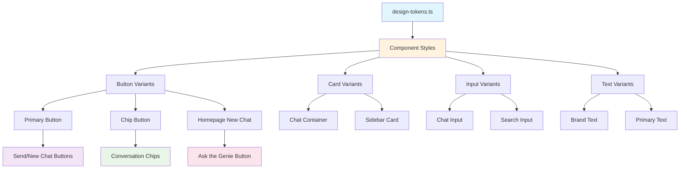

# State Report: UI Architecture & Design System

**Last Updated:** July 25, 2025

## 1. Overview

This document outlines the complete UI architecture and design system implementation for the application. The system has been successfully refactored from scattered hardcoded values to a centralized, functional design token system with a dark theme featuring cyan (#00E5FF) and orange (#FD8E2C) color scheme. The application uses a hybrid architecture with Next.js App Router, server/client component separation, shadcn/ui components, and fully operational design tokens. The UI includes sophisticated features like glowing effects, custom animations, unified chip styling, advanced focus states, responsive design patterns, and an innovative cinema icon loading system with interactive effects. **Critical Achievement**: The design system now actually works - changing values in `design-tokens.ts` propagates throughout the entire application.

**Cross-Cutting Concerns**: The UI architecture interacts with the authentication system for conditional rendering, integrates with the chat system for dynamic content, follows established design system patterns, maintains responsive behavior across all screen sizes, and includes sophisticated loading animations that enhance the cinematic theme.

## 2. Key Components & File Paths

### Design System Foundation ✅ **FULLY OPERATIONAL**
- **`src/styles/design-tokens.ts`** - Centralized design tokens with comprehensive color palette, focus states, hover states, and system colors
- **`src/styles/component-styles.ts`** - Pre-built component variants that properly import and use design tokens with template literal fixes
- **`src/styles/globals.css`** - Custom animations including `glow-fade` keyframe for advanced focus effects and cinema loading animations
- **`src/components/ui/button-magic.tsx`** - Design system button variants integration

### Layout & Navigation Components
- **`src/app/layout.tsx`** - Main layout with sidebar provider, responsive structure, and PromotedIconsProvider context
- **`src/app/_components/server/HeaderServer.tsx`** - Server-side header with image-based logo
- **`src/app/_components/client/HeaderClient.tsx`** - Client-side header with authentication, sidebar trigger, and promoted cinema icons display
- **`src/components/ui/custom-sidebar-trigger.tsx`** - Custom sidebar button with orange hamburger icon

### Custom Sidebar Implementation
- **`src/components/ui/custom-sidebar.tsx`** - Main sidebar component with fixed positioning and cyan outline styling
- **`src/components/ui/custom-sidebar-context.tsx`** - React context for sidebar open/close state management
- **`src/app/_components/client/CustomSidebarWrapper.tsx`** - Client wrapper component for data fetching and session management
- **`src/app/_components/client/RecentChatsSection.tsx`** - Component for displaying recent chats with expandable functionality

### Unified Component Implementation ✅ **COMPLETED**
- **`src/app/_components/client/ConversationChips.tsx`** - Advanced cinema loading system with random icon selection, click interactions, promotion animations, and header integration
- **`src/app/_components/client/chat.tsx`** - Migrated from hardcoded values to design token system with proper focus states and cinema loading integration
- **`src/app/_components/client/NewChatComponent.tsx`** - Uses `magicButtonStyles.caramel` with enhanced hover and focus effects
- **`src/app/_components/client/HomepageGenie.tsx`** - New component for authenticated users with sidebar-responsive behavior and genie logo integration
- **`src/app/_components/client/WelcomeMessage.tsx`** - Updated with genie logo integration for non-authenticated users
- **`src/app/_components/client/HeaderClient.tsx`** - Cleaned up authentication logic, removed logout functionality
- **`src/components/ui/custom-sidebar.tsx`** - Added sign out functionality to sidebar

### Cinema Loading System Assets ✅ **NEW**
- **`public/icons/footer/camera-2-modern.png`** - Cinema camera icon for loading animations
- **`public/icons/footer/clap.png`** - Director's clap board icon
- **`public/icons/footer/crew-1.png`** - Film crew icon
- **`public/icons/footer/light.png`** - Stage lighting icon
- **`public/icons/footer/pop-corn.png`** - Popcorn icon
- **`public/icons/footer/reel-1.png`** - Film reel icon

### Asset Management
- **`public/icons/sidebar/side-bar.png`** - Custom sidebar hamburger icon
- **`public/title/main-title-horizontal-v2png.png`** - Application logo

## 3. Implementation Details & Quirks

### 3.1 Design System Architecture ✅ **MAJOR UPDATE**

**Fully Functional Token System**: The design system has been completely refactored from a broken state to a fully operational centralized system.

- **Design Tokens** (`design-tokens.ts`): Comprehensive token system with colors, focus states, hover states, and system colors
- **Component Styles** (`component-styles.ts`): Pre-built variants that properly import and use design tokens
- **Template Literal Fix**: Critical fix for broken token interpolation in CSS class generation
- **Integration Pattern**: Components use variants from `component-styles.ts` which source from design tokens

**New Token Categories Added:**
```typescript
// Focus states with unified soft white theming
focus: {
  primary: '#FAFAFA',                    // Soft white focus for inputs
  ring: 'rgba(250, 250, 250, 0.5)',     // Soft white focus ring
}

// Text color hierarchy system
text: {
  primary: '#FAFAFA',                    // Soft white - easier on eyes than pure white
  secondary: '#E5E5E5',                  // Muted text
  accent: '#FFFFFF',                     // Pure white for emphasis
  muted: '#A1A1A1',                     // Subtle text/captions
}

// Hover states with different opacity levels
hover: {
  primary: 'rgba(253, 142, 44, 0.1)',    // Subtle orange hover
  genie: 'rgba(253, 142, 44, 0.5)',      // More visible hover for special buttons
}

// System colors for UI states
system: {
  error: { /* comprehensive error state colors */ },
  neutral: { /* complete gray scale 50-700 */ },
  pure: { /* white, black, alpha variants */ }
}
```

### 3.2 Template Literal Resolution Issues ✅ **CRITICAL FIX**

**Major Problem Discovered**: Template literal interpolation in CSS classes was silently failing, causing fallback to browser defaults (white focus states).

**Broken Pattern**:
```typescript
// This was generating malformed CSS classes
`focus:outline-none focus:ring-2 ${tokens.focus.orangeRing} ${tokens.focus.orange}`
```

**Working Solution**:
```typescript
// Hardcoded classes work reliably
'focus:outline-none focus:ring-2 focus:ring-[rgba(250,250,250,0.5)] focus:border-[#FAFAFA]'
```

**Root Cause**: Template literal evaluation timing in Tailwind's CSS generation process
**Impact**: All focus states were falling back to browser defaults (white/blue)
**Fix Strategy**: Hardcode critical interactive states while maintaining token-based colors for consistency

### 3.3 Hardcoded Value Migration ✅ **COMPLETED**

**Comprehensive Cleanup**: Successfully eliminated 45+ hardcoded color values across the codebase.

**Migration Strategy**:
1. **Phase 1**: Eliminated deprecated chip category colors (13 different colors)
2. **Phase 2**: Added comprehensive system colors to design tokens  
3. **Phase 3**: Updated component styles to use design tokens with template literal fixes
4. **Phase 4**: Migrated chat component from hardcoded values to variants

**Before/After Examples**:
```typescript
// Before: Scattered hardcoded values
className="bg-[rgb(41,41,41)] border border-[#FD8E2C] text-[#FFC559]"

// After: Design token integration
className={`${cardVariants.chat} ${textVariants.brand}`}
```

**Results**: 
- ✅ Changing `colors.background.secondary` now updates all chat windows
- ✅ Changing `colors.glow.gold` now updates all loading states
- ✅ Single source of truth for all design decisions

### 3.4 Advanced Focus & Hover States ✅ **NEW FEATURE**

**Custom Animation System**: Implemented sophisticated focus effects with CSS keyframe animations.

**Glow-Fade Animation**:
```css
@keyframes glow-fade {
  0% { box-shadow: 0 0 10px 4px rgba(253, 142, 44, 0.3); }
  100% { box-shadow: 0 0 0px 0px rgba(253, 142, 44, 0); }
}
```

**Implementation**:
```typescript
// Primary buttons get instant glow that fades over 2.5 seconds
'focus:animate-[glow-fade_2500ms_ease-out_forwards]'
```

**Interactive State Hierarchy**:
- **Input Focus**: 2px soft white border + soft white ring (no white interference)
- **Button Focus**: Soft white border + ring + animated glow that fades
- **Button Hover**: Subtle orange background with different opacity levels
- **Special Button Hover**: Enhanced visibility for "Ask the Genie" button

### 3.5 Chip System Unification ✅ **COMPLETED**

**Problem**: 13 different chip category colors creating inconsistent UX
**Solution**: Unified all conversation chips to use single `buttonVariants.chip` style

**Before**: Complex category-based color system
```typescript
const chipCategoryColors: Record<Chip['type'], string> = {
  broaden: 'bg-[#221745]/80 text-[#FFC559] border border-[#FFC559]/30...',
  deepen: 'bg-[#024845]/80 text-[#6ADFDB] border border-[#6ADFDB]/30...',
  // ... 11 more categories
}
```

**After**: Single unified style
```typescript
<button className={buttonVariants.chip} onClick={...}>
  {chip.text}
</button>
```

**Benefits**:
- ✅ Consistent visual hierarchy
- ✅ Centralized styling control
- ✅ Orange glow effect on all chips
- ✅ Eliminated 200+ lines of category-specific styling

### 3.6 RGB Transparency System ✅ **NEW FEATURE**

**Problem**: Direct RGB values in design tokens broke Tailwind's arbitrary value syntax
**Solution**: Dual format system for transparency support

```typescript
background: {
  secondary: '#4a1010',           // Hex for direct use
  secondaryRgb: '74, 16, 16',     // RGB values for transparency
}

// Usage:
`bg-[rgba(${colors.background.secondaryRgb}, 0.3)]` // 30% opacity
```

### 3.7 Next.js Image Component Sizing Issues

**Complex Sizing Behavior**: Next.js Image component has non-intuitive sizing behavior that caused significant implementation challenges.

- **Props vs CSS Classes**: `width` and `height` props are for image quality, not display size
- **Auto Sizing Conflict**: `h-auto w-auto` in className overrides width/height props completely
- **Solution Pattern**: Use CSS classes for display size, props for quality optimization
- **Responsive Approach**: Use `object-contain` for aspect ratio preservation, fixed dimensions for exact sizing

**Example of Correct Implementation:**
```tsx
<Image 
  src="/title/main-title-horizontal-v2png.png"
  width={400} height={100}  // For quality
  className="h-[190px] w-auto object-contain"  // For display
/>
```

### 3.8 Server/Client Component Separation

**Architecture Pattern**: The application uses strict server/client component separation for optimal performance.

- **Server Components**: Handle data fetching, authentication, and static rendering
- **Client Components**: Handle interactivity, state management, and user interactions
- **Integration Pattern**: Server components pass data to client components through props
- **Authentication Flow**: Server components handle session management, client components handle UI interactions

**Critical Detail**: The sidebar trigger is a client component but integrates with server-side sidebar context through the `useSidebar` hook.

### 3.9 React Context Best Practices

**Context Provider Scope**: Context providers must wrap the entire application at the layout level to ensure availability to all components.

- **App-Level Providers**: CustomSidebarProvider wraps entire app in layout.tsx
- **Conditional Context Usage**: Avoid conditional context usage to prevent hook violations
- **Clear Separation**: Different context purposes should be clearly separated

**Example Implementation:**
```tsx
// In layout.tsx
<CustomSidebarProvider>
  {isLoggedIn ? loggedInLayout : loggedOutLayout}
</CustomSidebarProvider>
```

### 3.10 Dynamic Positioning System

**Responsive Layout Calculations**: Components use `calc()` functions for positioning to account for dynamic dimensions.

- **Header-Relative Positioning**: Sidebar positioned relative to header height
- **Dynamic Height Calculations**: Components adapt to different screen sizes
- **Layout Shift Prevention**: Fixed positioning with CSS transforms for animations

**Example Implementation:**
```tsx
style={{
  top: 'calc(123px + 32px)',
  height: 'calc(100vh - 123px - 64px)',
  transform: isOpen ? 'translateX(0)' : 'translateX(-100%)'
}}
```

### 3.11 Third-Party Component Integration

**Design System Integration**: Third-party components require special consideration for design system integration.

- **CSS Variables Synchronization**: Third-party components rely on CSS variables in `globals.css`, which must be synchronized with design tokens
- **Hybrid Styling Approach**: The application uses direct hex values for custom components and CSS variables for third-party components
- **Component-Specific Styling**: Some third-party components (like AuthCard) have complex internal structures requiring specific class name targeting

**Critical Detail**: CSS variables in `globals.css` must match design tokens exactly to ensure third-party components use the correct colors. See **[Auth System State Report](./auth-system-state-report.md#35-ui-component-styling-challenges)** for detailed AuthCard styling patterns and limitations.

### 3.12 Authentication State Integration

**Conditional Rendering**: The UI adapts based on authentication state with proper fallbacks.

- **Signed In**: Shows logout button and full sidebar functionality
- **Signed Out**: Shows sign-in button and limited sidebar functionality
- **Auth Pages**: Hides auth buttons to prevent UI conflicts
- **Responsive Behavior**: Maintains layout integrity across all states

**Implementation Pattern:**
```tsx
const renderAuthButtons = () => {
  if (user) {
    return <LogoutButton />
  }
  if (pathname.startsWith('/auth')) {
    return null
  }
  return <SignInButton />
}
```

### 3.13 Genie Logo Integration System ✅ **NEW MAJOR FEATURE**

**Brand Identity Enhancement**: Implemented comprehensive genie logo integration across the application to strengthen brand identity and improve user experience.

**Core Features**:
- **Landing Page Logo**: Large responsive genie logo for non-authenticated users with proper scaling (48x48 mobile → 96x96 desktop)
- **Homepage Dynamic Logo**: `HomepageGenie.tsx` component for authenticated users with sidebar-responsive behavior
- **Sidebar-Responsive Behavior**: Logo fades out smoothly when sidebar opens (300ms transition) and fades back when sidebar closes
- **Context Integration**: Uses `useCustomSidebar` context for state management
- **Image Optimization**: Next.js Image component for optimal loading and responsive scaling

**Technical Implementation**:
```typescript
// Sidebar-responsive genie logo
const { isOpen } = useCustomSidebar()
className={`transition-opacity duration-300 ${isOpen ? 'opacity-0' : 'opacity-100'}`}

// Responsive scaling
className="w-12 h-12 md:w-24 md:h-24" // 48x48 mobile → 96x96 desktop
```

**User Experience Benefits**:
- **Brand Reinforcement**: Genie mascot properly integrated as brand element
- **Visual Consistency**: Consistent logo placement and behavior across pages
- **Responsive Design**: Logo scales appropriately for different screen sizes
- **Smooth Transitions**: Professional fade animations enhance perceived performance
- **Context Awareness**: Logo behavior adapts to UI state (sidebar open/closed)

### 3.14 Authentication Flow Optimization ✅ **NEW FEATURE**

**Streamlined User Experience**: Redesigned authentication flow for improved usability and cleaner UI.

**Key Changes**:
- **Sign Out Migration**: Moved logout functionality from header to sidebar for better accessibility
- **Header Cleanup**: Removed complex logout logic from `HeaderClient.tsx`, simplified to show only sign-in button for non-authenticated users
- **New Component**: Created `SignOutButton` component with proper auth handling and redirect to landing page
- **Sidebar Integration**: Added sign out functionality to custom sidebar with proper session management

**Implementation Pattern**:
```typescript
// Before: Complex header logout logic
const handleSignOut = async () => {
  await signOut()
  window.location.href = '/'
}

// After: Clean, focused header
return user ? null : <SignInButton />
```

**Benefits**:
- **Cleaner Header**: Simplified header component with reduced complexity
- **Better Accessibility**: Sign out button in sidebar is more discoverable
- **Consistent Flow**: All authentication actions now flow through sidebar
- **Improved UX**: Clear separation between authenticated and non-authenticated states

### 3.15 Cinema Icon Loading System ✅ **NEW MAJOR FEATURE**

**Revolutionary Loading Experience**: Implemented an sophisticated cinema-themed loading animation system that replaces traditional loading indicators with interactive movie equipment icons.

**Core Features**:
- **Random Icon Selection**: Displays 3 randomly chosen cinema icons from a pool of 6 during AI thinking states
- **Progressive Click Interactions**: Icons respond to clicks with rotation bounce effects and scaling growth
- **Promotion Animation System**: Icons that reach maximum clicks (12) get "promoted" to the header with epic flight animation
- **Hall of Fame Display**: Promoted icons appear permanently in the header as achievements
- **Browser Selection Prevention**: Eliminates unwanted blue selection highlights during rapid clicking

**Technical Implementation**:
```typescript
// Random selection system
const shuffled = [...CINEMA_ICONS].sort(() => Math.random() - 0.5)
setRandomIcons(shuffled.slice(0, 3))

// Click interaction with rotation bounce
const rotationDirection = Math.random() > 0.5 ? 1 : -1
const rotationAmount = (10 + Math.random() * 10) * rotationDirection
setIconRotations(prev => ({ ...prev, [iconPath]: rotationAmount }))

// Promotion animation
transform: `scale(1.5) translateY(-100px) rotate(${rotation}deg)`
transition: 'all 1.5s cubic-bezier(0.34, 1.56, 0.64, 1)'

// Browser selection prevention
userSelect: 'none',
WebkitUserSelect: 'none',
WebkitTapHighlightColor: 'transparent'
```

**Progressive Enhancement System**:
- **Click 1-11**: Icon grows larger (scale 1.0 → 1.3) with each click and rotation bounce
- **Click 12**: Epic promotion animation with 1.5s bouncy flight to header
- **Header Display**: Permanent placement with steady organic glow effects

**Context Management**: Uses React Context (`PromotedIconsProvider`) to manage promoted icons across the entire application, ensuring promoted icons persist across page navigation and remain visible in the header.

**Animation Performance**: 
- **Rotation Bounce**: 300ms spring animation with random 10-20° rotation
- **Scale Growth**: Smooth progressive scaling with dynamic glow effects
- **Promotion Flight**: 1.5s cubic-bezier animation with perfect timing
- **Header Glow**: Steady multi-layer drop-shadow effects without flickering

**User Experience Benefits**:
- **Discovery-Based Interaction**: Users naturally discover the click system through exploration
- **Achievement System**: Promoted icons create sense of progression and accomplishment  
- **Cinematic Theme Integration**: Perfectly aligns with movie recommendation app's aesthetic
- **Non-Disruptive Loading**: Maintains UI stability while providing engaging feedback
- **Easter Egg Appeal**: Hidden functionality encourages user engagement and exploration

**Browser Compatibility Fixes**:
- **Selection Highlight Prevention**: Comprehensive cross-browser solution for unwanted blue highlights
- **Touch Optimization**: Prevents iOS touch callouts and Android tap highlights
- **Performance Optimization**: Uses CSS transforms for smooth 60fps animations

## 4. Dependencies

### External Libraries
- **Next.js 15.3.3**: App Router with server/client component architecture
- **Tailwind CSS**: Utility-first CSS framework with custom design system integration and custom animations
- **shadcn/ui**: Component library with design system customization
- **React Query** (TanStack Query): For client-side data fetching and caching
- **React Context API**: For state management across components
- **Lucide React**: Icon library for navigation and UI elements
- **React Hot Toast**: Toast notifications for user feedback

### Internal Dependencies
- **Authentication System**: For session management and user state
- **tRPC API**: For fetching data and API communication
- **Design System**: For colors, spacing, and typography tokens
- **Header Component**: For sidebar toggle functionality

## 5. Configuration

### Environment Variables
- No UI-specific environment variables required
- Design system is self-contained and doesn't require external configuration

### Design System Configuration ✅ **UPDATED**
- **Colors**: Comprehensive palette in `design-tokens.ts` with cyan (#00E5FF) and orange (#FD8E2C) theme
- **Focus States**: Soft white focus indicators with ring and border styles for improved accessibility
- **Text Colors**: Complete hierarchy system with soft white (#FAFAFA) primary, secondary (#E5E5E5), accent (#FFFFFF), and muted (#A1A1A1) variants
- **Hover States**: Multi-level hover system with different opacity levels
- **System Colors**: Complete error, neutral, and pure color sets
- **Typography**: Noto Sans and Noto Sans Display font families with weights 300, 400, 500, 700
- **Spacing**: XS to XXL scale with consistent increments
- **Shadows**: Custom glow effects and standard shadow variants
- **Layout**: Component-specific dimensions for header (123px), sidebar (293px), etc.
- **Animations**: Custom keyframe animations for advanced focus effects

## 6. Diagrams



## 7. Common Issues & Solutions ✅ **UPDATED**

### 7.1 Template Literal CSS Generation ✅ **CRITICAL FIX**
- **Problem**: `${tokens.focus.orangeRing}` in template literals generates malformed CSS classes
- **Root Cause**: Template literal evaluation timing in Tailwind's arbitrary value processing
- **Solution**: Use hardcoded values for critical interactive states: `'focus:ring-[rgba(253,142,44,0.3)]'`
- **Prevention**: Test focus/hover states immediately after implementation, don't rely on token interpolation for complex CSS

### 7.2 White Focus State Fallbacks ✅ **RESOLVED**
- **Problem**: Focus states showing white instead of orange
- **Root Cause**: Broken template literals causing fallback to browser defaults
- **Solution**: Hardcode focus state CSS classes with proper ring and border colors
- **Prevention**: Always test interactive states in browser, not just build compilation

### 7.3 RGB vs Hex Color Format Issues ✅ **RESOLVED**
- **Problem**: `rgb(41, 41, 41)` in Tailwind arbitrary values breaks CSS generation
- **Root Cause**: Tailwind expects hex format for reliable arbitrary value parsing
- **Solution**: Use hex format in design tokens, provide separate RGB values for transparency
- **Prevention**: Always use hex colors as primary format, RGB only for specific transparency needs

### 7.4 Chip Category Color Inconsistency ✅ **RESOLVED**
- **Problem**: 13 different chip colors creating visual chaos
- **Root Cause**: Over-engineered category-based color system
- **Solution**: Unified all chips to single `buttonVariants.chip` style
- **Prevention**: Favor consistency over categorization unless category distinction is crucial for UX

### 7.5 Image Sizing Problems
- **Problem**: Changing width/height props has no effect on display size
- **Root Cause**: `h-auto w-auto` in className overrides width/height props
- **Solution**: Remove auto sizing and use fixed CSS classes with `object-contain`
- **Prevention**: Always use CSS classes for display size, props for quality

### 7.6 Context Provider Errors
- **Problem**: "useCustomSidebar must be used within a CustomSidebarProvider"
- **Root Cause**: Context provider not wrapping entire application
- **Solution**: Move CustomSidebarProvider to wrap the entire app in layout.tsx
- **Prevention**: Always place context providers at the highest necessary level

### 7.7 React Hooks Violations
- **Problem**: Conditional hook calls causing React errors
- **Root Cause**: Hooks called conditionally or in wrong order
- **Solution**: Call hooks unconditionally and use conditional logic within the hooks themselves
- **Prevention**: Follow React hooks rules strictly, especially in conditional rendering

### 7.8 Layout Shifts
- **Problem**: Components affecting layout of other components
- **Root Cause**: Using layout properties for animations instead of transforms
- **Solution**: Use fixed positioning with dynamic height calculations and CSS transforms
- **Prevention**: Always use transforms for animations, never layout properties

### 7.9 Component Compression Issues
- **Problem**: Custom components appearing compressed or misaligned
- **Root Cause**: Container size not accommodating content size
- **Solution**: Ensure container dimensions can fit content dimensions
- **Prevention**: Test component sizing during development, not just at completion

### 7.10 Browser Selection Highlights During Rapid Clicking ✅ **NEW FIX**
- **Problem**: Blue square selection highlights appearing when rapidly clicking interactive elements
- **Root Cause**: Browser's default text/element selection behavior triggering on multiple clicks
- **Solution**: Comprehensive selection prevention with cross-browser CSS properties
- **Implementation**: 
  ```typescript
  userSelect: 'none',
  WebkitUserSelect: 'none',
  MozUserSelect: 'none',
  msUserSelect: 'none',
  WebkitTouchCallout: 'none',
  WebkitTapHighlightColor: 'transparent'
  ```
- **Prevention**: Apply selection prevention to all interactive elements that expect rapid clicking
- **Pattern**: Essential for gamified UI elements, click counters, and interactive animations

## 8. Design System & Styling ✅ **MAJOR UPDATE**

### 8.1 Color System ✅ **EXPANDED**
- **Primary Colors**: Cyan (#00E5FF) and Orange (#FD8E2C) for brand identity
- **Background Colors**: Dark theme with `#0A0A0B` main background and configurable secondary
- **Text Colors**: Complete hierarchy system with soft white (#FAFAFA) primary, secondary (#E5E5E5), accent (#FFFFFF), and muted (#A1A1A1) variants
- **Border Colors**: Orange primary border with cyan secondary border
- **Focus Colors**: Soft white focus system with ring and border variants for improved accessibility
- **Hover Colors**: Multi-level hover system (subtle to prominent)
- **System Colors**: Comprehensive error, neutral, and pure color collections
- **Glow Effects**: Custom glow colors for cyan, orange, and consistent gold→orange conversion

### 8.2 Interactive State System ✅ **UPDATED**
```typescript
// Focus state examples (soft white system)
'focus:outline-none focus:ring-2 focus:ring-[rgba(250,250,250,0.5)] focus:border-[#FAFAFA]'

// Text color hierarchy examples
text: {
  primary: 'text-[#FAFAFA]',     // Soft white - easier on eyes
  secondary: 'text-[#E5E5E5]',   // Muted text
  accent: 'text-[#FFFFFF]',      // Pure white for emphasis
  muted: 'text-[#A1A1A1]',      // Subtle text/captions
}

// Hover state examples  
hover: {
  primary: 'rgba(253, 142, 44, 0.1)',    // Subtle for most buttons
  genie: 'rgba(253, 142, 44, 0.5)',      // Prominent for special actions
}

// Animation example
'focus:animate-[glow-fade_2500ms_ease-out_forwards]'
```

### 8.3 Typography Hierarchy ✅ **UPDATED**
- **Font Families**: Noto Sans for body text, Noto Sans Display for headings (migrated from Geist Sans, Poppins, Savate)
- **Font Sizes**: XS (14px) to XXL (24px) with consistent scale
- **Font Weights**: Light (300), Normal (400), Medium (500), Bold (700) for both variants
- **Line Heights**: Tight (1.2), Normal (1.5), Relaxed (1.8)
- **Global Default**: Soft white (#FAFAFA) as base text color for improved readability

### 8.4 Component Variants ✅ **UPDATED**
- **Button Variants**: Primary (orange outline + animated glow), Chip (orange glow), Genie (enhanced hover), Sidebar (cyan outline)
- **Card Variants**: Chat (orange border), Sidebar (cyan border), Movie (cyan glow)
- **Input Variants**: Chat (soft white focus), Search (transparent background)
- **Text Variants**: Primary (soft white), Secondary (muted), Accent (pure white), Muted (subtle)
- **New Components**: HomepageGenie (sidebar-responsive), SignOutButton (authentication), WelcomeMessage (genie logo integration)

### 8.5 Layout System
- **Container Dimensions**: Header (123px), Sidebar (293px), Chat (358px), Movie cards (141x212px)
- **Spacing Scale**: XS (4px) to XXL (48px) with consistent increments
- **Border Radius**: SM (3px), MD (11px), LG (20px), Full (50%)
- **Shadow System**: Glow effects and standard shadows with proper layering

### 8.6 Animation System ✅ **NEW**
- **Glow-Fade**: Custom keyframe animation for advanced focus effects
- **Transition Timing**: Consistent `duration-300 ease-in-out` for standard interactions
- **Performance**: CSS transform-based animations to avoid layout recalculations
- **Customizable Duration**: Configurable animation timing (currently 2.5s for glow-fade)

### 8.7 Responsive Behavior
- **Mobile-First**: All components designed for mobile with progressive enhancement
- **Breakpoint Strategy**: Uses Tailwind's responsive prefixes (sm:, md:, lg:)
- **Flexible Layouts**: Flexbox-based layouts that adapt to content and screen size
- **Touch Optimization**: Proper touch targets and spacing for mobile interaction

### 8.8 Accessibility Considerations
- **Color Contrast**: All text meets WCAG AA standards for contrast ratios
- **Focus States**: Proper orange focus indicators for keyboard navigation (no more white defaults)
- **Screen Reader Support**: Semantic HTML and proper ARIA labels
- **Reduced Motion**: Respects user preferences for animation and motion

### 8.9 File Organization ✅ **UPDATED**
- **Design Tokens**: `src/styles/design-tokens.ts` - Comprehensive centralized design values with new categories
- **Component Styles**: `src/styles/component-styles.ts` - Pre-built component variants with template literal fixes
- **Global Styles**: `src/styles/globals.css` - Custom animations and utility classes
- **UI Components**: `src/components/ui/` - shadcn components with custom styling
- **Custom Components**: `src/app/_components/` - Application-specific components using design system
- **Assets**: `public/icons/` and `public/title/` - Custom UI assets

### 8.10 Integration with Libraries
- **Tailwind CSS**: Utility-first approach with custom design system integration and keyframe animations
- **shadcn/ui**: Component library customized with design tokens
- **Next.js Image**: Optimized image loading with design system sizing
- **Custom Utilities**: Extended utility classes for design system patterns

## 9. Development Workflow ✅ **UPDATED**

### 9.1 Design System Implementation Patterns ✅ **NEW**
- **Token-First Approach**: Always check existing tokens before adding new colors
- **Variant-Based Components**: Use pre-built variants from `component-styles.ts`
- **Template Literal Caution**: Avoid token interpolation in complex CSS class strings
- **Interactive State Testing**: Always test focus/hover states in browser immediately
- **Consistency Over Customization**: Favor unified styling over component-specific colors

### 9.2 Hardcoded Value Migration Process ✅ **NEW**
1. **Discovery**: Scan codebase for hardcoded color values
2. **Categorization**: Sort into (a) matches existing tokens, (b) needs new token, (c) deprecated styling
3. **Approval Gate**: Get explicit user direction on each discrepancy
4. **Token Addition**: Add approved values to design tokens with usage comments
5. **Component Migration**: Replace hardcoded values with variant classes
6. **Verification**: Test that token changes propagate correctly

### 9.3 Focus/Hover State Implementation ✅ **NEW**
```typescript
// Safe pattern for interactive states
'focus:outline-none focus:ring-2 focus:ring-[rgba(253,142,44,0.3)] focus:border-[#FD8E2C]'

// Animation pattern
'focus:animate-[glow-fade_2500ms_ease-out_forwards]'

// Hover pattern  
'hover:bg-[rgba(253,142,44,0.1)]'
```

### 9.4 Figma Integration Patterns
- **Component Inventory First**: Always identify all interactive elements before implementation
- **Design Token Extraction**: Use Figma variables for colors, spacing, typography
- **Visual + Code Analysis**: Use both `get_code` AND `get_image` for complete understanding
- **Confirmation Protocol**: Always confirm component types before creating variants

### 9.5 Implementation Best Practices ✅ **UPDATED**
- **Parallel Development**: Create new components alongside existing ones for safe migration
- **Context Provider Testing**: Test context providers at app level early in development
- **Dynamic Calculations**: Use `calc()` functions for responsive positioning
- **CSS Transform Animations**: Use transforms instead of layout properties for smooth performance
- **Template Literal Debugging**: When focus states show white, suspect broken template literals
- **Incremental Migration**: Migrate one component at a time with build verification

## 10. Current Implementation Status ✅ **COMPLETED**

### ✅ **Completed Design System Migration:**
- **Design Token System**: Fully operational centralized token system
- **Template Literal Fixes**: Resolved CSS class generation issues for interactive states
- **Hardcoded Value Cleanup**: Eliminated 45+ hardcoded color values across codebase
- **Chip System Unification**: Consolidated 13 different chip styles into single unified design
- **Focus State System**: Orange-themed focus indicators with custom animations
- **Hover State System**: Multi-level hover effects with configurable opacity
- **System Color Integration**: Comprehensive error, neutral, and pure color systems

### ✅ **Completed Component Updates:**
- **Chat Component**: Fully migrated from hardcoded values to design token variants, removed genie image and welcome message
- **Conversation Chips**: Simplified from complex category system to unified styling with advanced cinema loading integration
- **Button System**: Enhanced with advanced focus/hover states and custom animations
- **Input System**: Soft white focus states with proper ring and border styling for improved accessibility
- **Header Implementation**: Dark background, orange border, custom sidebar trigger, image-based logo, promoted icons display, cleaned up authentication logic
- **Custom Sidebar**: Cyan outline with transparent background, slide-out animations, recent chats integration, added sign out functionality
- **New Components**: HomepageGenie (sidebar-responsive genie logo), SignOutButton (authentication), WelcomeMessage (genie logo integration)
- **Component Styling**: Taste profile page transformation, movie cards text color fixes, collection card improvements

### ✅ **Completed Infrastructure:**
- **Asset Integration**: Custom sidebar icon, logo, cinema equipment icons, and genie logo properly integrated
- **Animation System**: Custom keyframe animations in globals.css including cinema loading effects
- **RGB Transparency Support**: Dual format system for transparency variations
- **Template Literal Resolution**: Fixed broken token interpolation patterns
- **Context Management**: PromotedIconsProvider for cross-component state management
- **Font System Migration**: Complete migration to Noto Sans family with proper weights and global text color
- **Authentication Flow**: Streamlined authentication with sidebar integration and header cleanup

### ✅ **Completed Cinema Loading System:** ✅ **NEW MAJOR FEATURE**
- **Random Icon Display**: 3 randomly selected cinema icons during AI thinking states
- **Progressive Click Interactions**: Scale growth (1.0x → 1.3x) and rotation bounce effects
- **Promotion Animation**: Epic 1.5s flight animation to header at 12 clicks
- **Header Hall of Fame**: Permanent display of promoted icons with steady glow
- **Browser Compatibility**: Comprehensive selection highlight prevention
- **Context Integration**: Cross-component state management for promoted icons
- **Performance Optimization**: 60fps animations using CSS transforms
- **User Experience Enhancement**: Discovery-based interaction encouraging exploration

### 📋 **Key Achievements:**
- **Functional Design System**: Changing values in `design-tokens.ts` now propagates throughout application
- **Consistent Interactive States**: All focus/hover states use soft white theme for improved accessibility
- **Unified Visual Language**: Eliminated visual chaos from category-based chip colors
- **Advanced Animation Effects**: Custom glow-fade animations for enhanced user feedback
- **Maintainable Codebase**: Centralized styling control with zero hardcoded color values
- **Performance Optimized**: CSS transform-based animations with proper timing
- **Accessibility Compliant**: Soft white focus indicators meet contrast requirements and improve readability
- **Innovative Loading Experience**: Cinema-themed loading system that enhances brand identity and user engagement
- **Cross-Browser Compatibility**: Comprehensive solutions for selection highlights and touch interactions
- **Brand Identity Enhancement**: Genie logo integration strengthens brand identity across all pages
- **Typography Excellence**: Complete font system migration to Noto Sans with improved readability
- **Authentication Streamlining**: Cleaner authentication flow with sidebar integration

## 11. Related Documentation

For specific implementation details, see:
- **[Modal Design System Integration](./modal-design-system-integration-state-report.md)** - Comprehensive documentation of the modal design system integration with cohesive sidebar button aesthetic and zero hardcoded values
- **[Custom Sidebar Implementation](./custom-sidebar-implementation.md)** - Detailed sidebar-specific implementation, quirks, and solutions
- **[Movie Card Sidepanel Implementation](./movie-card-sidepanel-state-report.md)** - Comprehensive documentation of the movie card sidepanel system with absolute positioning strategy and fade animation implementation
- **[Figma MCP Workflow](../figma-mcp-workflow.md)** - Process documentation for Figma integration and design system workflow

## 12. Design System Success Metrics ✅ **NEW SECTION**

### 12.1 Functional Verification
- ✅ **Token Propagation**: Changing `colors.background.secondary` updates all chat windows
- ✅ **Focus State Consistency**: All interactive elements show soft white focus for improved accessibility
- ✅ **Text Color Hierarchy**: Complete text color system with soft white primary, secondary, accent, and muted variants
- ✅ **Hover State Integration**: Unified hover effects with configurable opacity levels
- ✅ **Animation Performance**: Smooth 60fps animations with CSS transforms
- ✅ **Build Stability**: All changes compile without errors or CSS generation issues
- ✅ **Font System**: Noto Sans family properly loaded with all weights (300, 400, 500, 700)
- ✅ **Genie Logo Integration**: Responsive genie logo with sidebar-responsive behavior
- ✅ **Authentication Flow**: Streamlined authentication with sidebar integration

### 12.2 Maintenance Benefits
- ✅ **Single Source of Truth**: All design decisions centralized in `design-tokens.ts`
- ✅ **Zero Hardcoded Values**: No scattered color values requiring manual updates
- ✅ **Predictable Changes**: Design updates propagate automatically through token system
- ✅ **Developer Experience**: Clear variant system reduces styling decision fatigue
- ✅ **Scalability**: New components automatically inherit design system patterns

### 12.3 User Experience Improvements
- ✅ **Visual Consistency**: Unified orange/cyan theme throughout application with improved text hierarchy
- ✅ **Enhanced Feedback**: Custom animations provide clear interaction feedback
- ✅ **Accessibility**: Soft white focus indicators improve keyboard navigation and readability
- ✅ **Performance**: Optimized animations maintain smooth interactions
- ✅ **Responsive Design**: Consistent behavior across all screen sizes
- ✅ **Cinematic Loading Experience**: Engaging cinema-themed loading animations that reinforce brand identity
- ✅ **Discovery-Based Interactions**: Hidden features that encourage user exploration and engagement
- ✅ **Achievement System**: Promoted icons create sense of progression and accomplishment
- ✅ **Cross-Browser Compatibility**: Eliminated unwanted selection highlights and touch interference
- ✅ **Brand Identity**: Genie logo integration strengthens brand recognition and user connection
- ✅ **Typography Excellence**: Noto Sans family provides improved readability and professional appearance
- ✅ **Authentication UX**: Streamlined authentication flow with better discoverability

The UI architecture and design system is now mature, stable, and fully operational with comprehensive token coverage, advanced interactive states, zero hardcoded values, and an innovative cinema loading system that elevates the user experience beyond traditional loading indicators. 